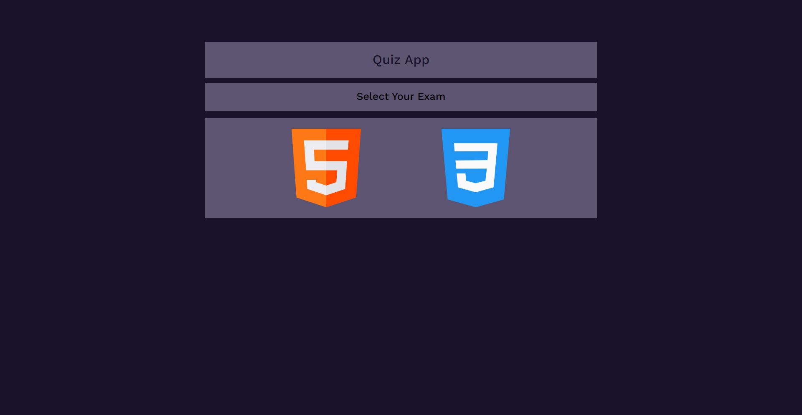
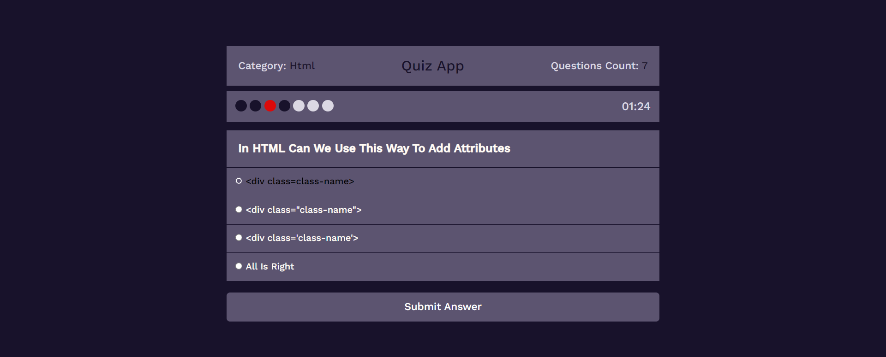
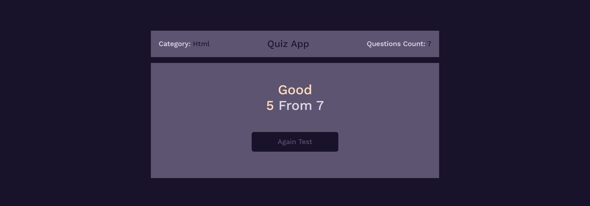

# QuizY-App
- This is a Web App created to make quizzes in random questiones in specific topic.
- User can select specific topic to test in.
- for 7 questions user can select from 4 choses in 1minute and 30 seconds.
- then he show his score in this topic.
- and can take another exam.
- questions are randomly every time and the choses also.
# Covered Topics :
- html5
- css3
- javaScript
- Es6
- Dom - Bom - Json - Random
# Site ScreenShot :

